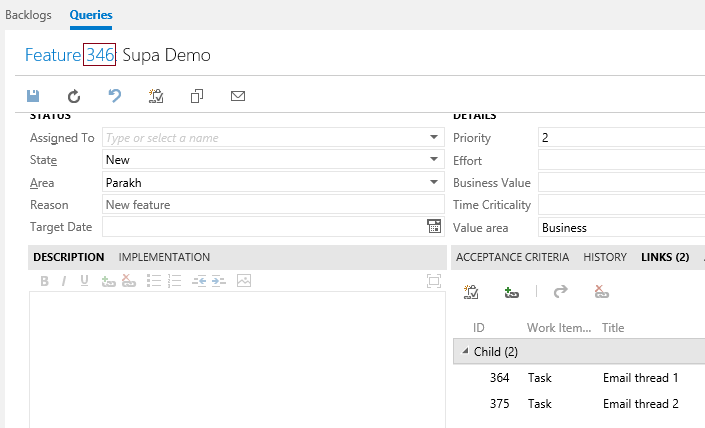

# Supa
A friendly support assistant!

Supa listens to your exchange server for emails and creates tfs tasks for them.
All of that, with < 20 lines of json configuration :)

---
## Getting started
Get a copy of Supa from [github
releases](https://github.com/codito/supa/releases).

Unzip it to a directory say `c:\supa`. Just run `.\supa.exe` to run supa. Before
that, let's help supa locate the email source and tfs sink. On to
configuration...

---
## Configure

Copy the `settings.sample.json` to `settings.json`. Default settings look like

    {
	"ExchangeSource": {
		"ServiceUri": "https://outlook.office365.com/EWS/Exchange.asmx",
		"Username": "supabot@outlook.onmicrosoft.com",
		"Password": "SuperSecretPAssW0rd!",
		"FolderName": "SupaDemo"
	},
	"TfsSink": {
		"ServiceUri": "https://supademo.visualstudio.com/DefaultCollection",
		"Username": "tfsuser",
		"Password": "tfspersonalAccessTokenWithReadWriteAccessToWorkItems",
		"ParentWorkItem": 346,
		"WorkItemTemplate": {
			"Title": "{{Topic}}",
			"Description": "{{Description}}",
			"Field1": "Default Value"
		}
	}
    }

We will cover each setting in detail below.

---
## Exchange setup

For this example, let's assume your customer emails arrive at the discussion
list email id `support@outlook.onmicrosoft.com`. We're going to add a bot
account to the list, let's call that `supabot@outlook.onmicrosoft.com`.

So all emails to `support@outlook.onmicrosoft.com` arrive in the inbox of
`supabot`.

Now first thing is to isolate those support emails from everything else, let's
create an exchange rule.

We will have all the support emails move to `Inbox\SupaDemo` folder in
`supabot@outlook.onmicrosoft.com` email account.

Let's revisit our json configuration now. It is pretty much self explanatory.
Supa will listen to new email threads in `SupaDemo` folder.

	"ExchangeSource": {
		"ServiceUri": "https://outlook.office365.com/EWS/Exchange.asmx",
		"Username": "supabot@outlook.onmicrosoft.com",
		"Password": "SuperSecretPAssW0rd!",
		"FolderName": "SupaDemo"
	},

---
## Tfs setup

Supa uses work item links to identify existing work items for exchange email
threads. We need to setup a `ParentWorkItem`, just another `Feature` work item.
All the tasks we create will be added as Related Links to this umbrella work
item. It makes our job to query these much easier too!

Secondly, we need to provide a template for fields to Supa. Based on your team's
work item template, the mandatory fields for a work item can differ. Also, supa
has some metadata around email threads which we need in the tasks. We will use
the `WorkItemTemplate` node in `settings.json` for this.

Here's how the parent work item looks:

And the Task created by Supa:

Tfs section in `settings.json` will look like below. For access, we use a tfs
personal access token which only has read/write access to work items.

	"TfsSink": {
		"ServiceUri": "https://supademo.visualstudio.com/DefaultCollection",
		"Username": "tfsuser",
		"Password": "tfspersonalAccessTokenWithReadWriteAccessToWorkItems",
		"ParentWorkItem": 346,
		"WorkItemTemplate": {
			"Title": "{{Topic}}",
			"Description": "{{Description}}",
			"Field1": "Default Value"
		}

`WorkItemTemplate` field takes following well known inputs.

* `{{Topic}}`: Replaced with email subject.
* `{{Description}}`: Replaced with email description (collates all emails in the
  conversation)
* `{{Id}}`: Unique id that identifies an email conversation
* `{{Activity}}`: Number of emails in the conversation

---
## Support

Please create a github issue for any bugs you encounter. We gladly accept pull
requests :)

---
## License

MIT
